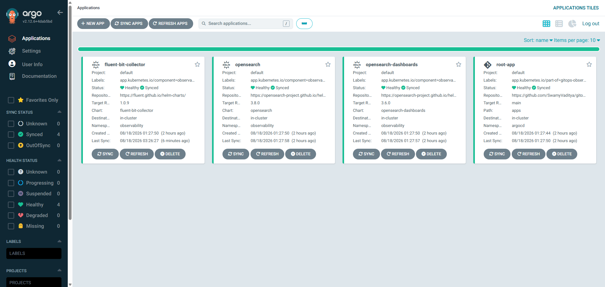

# gitops-observability-config

GitOps config repo for the local GitOps Observability Lab. **This repo
contains no application source code and no Dockerfiles — only declarative
Kubernetes/Helm config that Argo CD reconciles against the cluster.**

Cluster + Argo CD provisioning lives in the separate
`gitops-observability-infra` repo (Terraform). This repo is what Argo CD
watches once that bootstrap is done.

## Architecture


This repo owns the **right-hand side**: everything Argo CD reconciles once
it's watching this repo — the App-of-Apps discovery in `apps/`, the
multi-source `Application` objects that pair each upstream Helm chart with
`environments/local/.../values.yaml`, and the resulting OpenSearch, Fluent
Bit Collector, and OpenSearch Dashboards workloads in the `observability`
namespace. The cluster and Argo CD itself come from
`gitops-observability-infra` — this repo assumes both already exist.

## Verified working


*All 4 Applications (`root-app`, `opensearch`, `opensearch-dashboards`,
`fluent-bit-collector`) reconciled and healthy on a local k3d cluster,
after resolving the `/etc/machine-id` hostVolume issue documented in the
infra repo's `RUNBOOK.md`.*

## Layout

```
apps/                   Argo CD Application manifests only (App-of-Apps)
├── root/                 the one manifest you apply by hand (bootstrap)
├── infra/                platform-level Applications (Traefik, etc. — Step 4)
└── observability/        EFK-equivalent stack: OpenSearch, Dashboards, Fluent Bit

environments/
└── local/                 values.yaml overlays for the `local` environment
    └── observability/       one subfolder per Helm release
```

Adding a `environments/staging/` or `environments/prod/` later means adding
sibling folders here with their own `values.yaml` — the chart references in
`apps/` stay the same, only the Application's `valueFiles` path changes.

## Bootstrapping (one-time, manual)

After Argo CD is installed (via the infra repo's Terraform) and this repo
is pushed to a real remote:

```bash
# Replace YOUR_GITHUB_ORG in apps/root/root-app.yaml and every apps/observability/*.yaml
# with your actual repo URL first.

kubectl apply -f apps/root/root-app.yaml
```

From here on, everything is automatic: Argo CD watches `apps/` recursively,
discovers `apps/observability/*.yaml`, and syncs each one. Adding a new
Application manifest to this repo and pushing is the entire deployment
workflow — no further `kubectl apply`.

## Verifying versions before you sync

Every child `Application` pins a chart `targetRevision` as of Aug 2026, with
a comment showing how to check for a newer one. Confirm before your first
sync, since these are external charts this repo doesn't control:

```bash
helm repo add opensearch https://opensearch-project.github.io/helm-charts/
helm repo add fluent https://fluent.github.io/helm-charts/
helm repo update
helm search repo opensearch/ fluent/fluent-bit-collector --versions
```

## Known follow-ups (flagged, not yet resolved)

- Security plugins are disabled on both OpenSearch and Dashboards
  (`DISABLE_SECURITY_PLUGIN`, `DISABLE_SECURITY_DASHBOARDS_PLUGIN`) —
  lab-only simplification, not something to carry into shared environments.

Resolved: `opensearchHosts`/`Host` matching the real
`opensearch-cluster-master` Service name, and the `fluent-bit-collector`
`/etc/machine-id` hostVolume mount failing on k3d nodes — see infra repo's
`RUNBOOK.md` for the fix.
